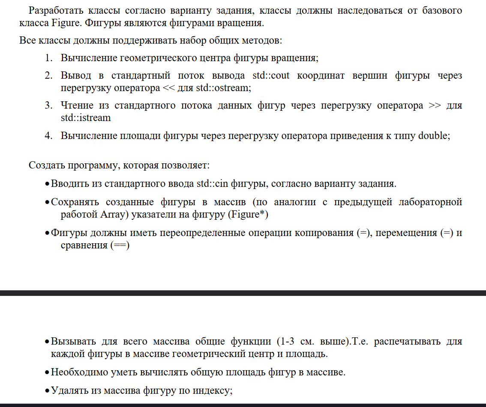

## Лабораторная работа №3 - Тема: Изучение базовых приемов ООП: Наследование и полиморфизм
### Вариант задания: 9, Группа - М8О-211БВ-24, Кукава И.Г.

#### Задание - Треугольник Квадрат Прямоугольник

